# pico - convert PDF to images with progress

A Go implementation for [@Belval](https://github.com/Belval)'s Python [pdf2image](https://github.com/Belval/pdf2image) but with progress support.




## Install package and dependency

```
$ go install github.com/DeathKing/pico/...@latest
```

> **NOTICE**  
> this will also install the binary `pdf2image` in `$GOPATH/bin` folder.

### Windows

Windows users will have to build or download poppler for Windows. I recommend [@oschwartz10612 version](https://github.com/oschwartz10612/poppler-windows/releases/) which is the most up-to-date. You will then have to add the `bin/` folder to [PATH](https://www.architectryan.com/2018/03/17/add-to-the-path-on-windows-10/) or use `WithPopperPath("C:/path/to/poppler-xx/bin")`.

### Mac

Mac users will have to install [poppler](https://poppler.freedesktop.org/).

Installing using [Brew](https://brew.sh/):

```
brew install poppler
```

### Linux

Most distros ship with `pdftoppm` and `pdftocairo`. If they are not installed, refer to your package manager to install `poppler-utils`

### Platform-independant (Using `conda`)

Install poppler: `conda install -c conda-forge poppler`

## Usage

### Programmatically use it as a library

```go
import "github.com/DeathKing/pico"

func main() {

    // Case 1. Silently convert file with single worker, you must use `Wait()`
    //         for synchronization
    // see _example/single/main.go
    task, _ := pico.Convert("path/to/pdf")
    task.Wait()

    // Case 2. Convert single file with multiple worker, instead of `Wait()`
    //         for final result, we take the per-page conversion result through
    //         `Entries` channel. In this situation, `task.Wait()` is not a
    //         neccessary
    // see _example/woker/main.go
    task, _ = pico.Convert("path/to/pdf",
        pico.WithJob(4),
    )

    // entry is like ["current_page" "total_page" "output_filename" "worker_index"]
    for entry := range task.Entries {
		fmt.Printf("page %s is converted as file %s \n",
			entry[0], // current page
			entry[2], // output filename
		)
	}

    // Case 3. A more fancy usage
    task, _ = pico.Convert("path/to/pdf",
        pico.WithPopperPath("path/to/poppler"),
        pico.WithFormat("jpg"),
        pico.WithDPI(72),
        pico.WithPageRange(22, 42),             // Convert from Page 22 to Page 42 (included)
        pico.WithJob(3)                         // Using 3 worker/process to convert
        pico.WithTimeout(10 * time.Second)      // Must finished within 10 seconds
    )

    // `WaitAndCollect()` will blocked the excution and collect the conversion
    // result into a slice.
    for _, item := task.WaitAndCollect() {
        fmt.Printf("[worker#%d] file: %s %s/%s", entry[3], entry[2], entry[0], entry[1])
    }
}

```

### Use it as a command line tool

```txt
df2image [-d dpi] [-f firstPage] [-l lastPage] [-j n] [-o outputFolder] path/to/file pattern/to/folder
```

For more detail , see `cmd/pdf2image/main.go`.

## TODO

+ [x] `outputFileFn()` to specify output filename by function.
+ [x] `Converts()` function which support concurrently convert multiple files.
+ [x] implement `WithScale()/WithSize()/WithScaleToX()/WithScaleToY` option
    - `WithScale(400)` or `WithSize(400)` will fit the image to a 400x400 box, preserving aspect ratio.
    - `WithScaleToX(400)` will make the image 400 pixels wide, preserving aspect ratio.
    - `WithScaleToY(400)` will make the image 400 pixels height, preserving aspect ratio.
+ [ ] explaining each parameters in detail.
+ [ ] more robust command line parsing.
+ [ ] more test cases.

## Limitations / known issues

1. Not working well with filename or path that contains CJK characters (this may caused by poppler).

## Credit

Much thanks go to [Edouard Belval](https://github.com/Belval) for not only his original Python library [pdf2image](https://github.com/Belval/pdf2image) which inspires this Golang variation, but also the `poppler` installation instructions.